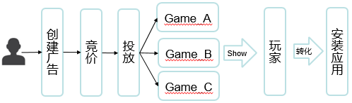

# 广告主常见问题

## 一、Dianview是什么？

是点乐旗下的全球移动视频广告平台，致力于做玩家喜欢的广告！

## 二、我们的优势？

- 获得高质量玩家和留存：将广告投放给大量精准高质量的目标玩家，实现后续留存。
- 目标专注于转化效果：CPI和 CPV两种竞价计费方式，降低广告主风险。
- 广告创意体验流畅：独家高清视频压缩与缓存技术，1080p高质量视频，零卡顿播放。
- 以视频为载体的广告形式：通过丰富的高清沉浸式体验呈现游戏精彩预告。

## 三、目前可支持的投放平台？
IOS+Android
  -iOS7或更高版本
  -Android版本2.3或更高版本

## 四、广告创意展现形式？

15至30秒高清视频+末尾卡片

## 五、广告展现排序及策略

按照ecpm排序，根据广告历史数据，预估转化效果，算法智能优化广告展现策略，保证广告主利益。

## 六、计费模式？

- （优先推荐）CPI：每次安装成本。按每次用户转化安装应用计费，需要单独的服务端对接
- CPV：每次完成查看成本。按每次用户完全观看视频广告计费

## 七、创意物料规格

#### 视频规格

- 分辨率：1920×1080像素（16：9）。
- 长度：15至30秒。
- 文件格式：H.264编码的MOV，MP4，AVI或文件格式。
- 文件大小：推荐大小为10MB。最大容量为100MB。最终播放的视频将针对用户的网络和高速缓存设置进行优化。  

#### 末尾卡片素材

视频结束时展现引导下载页面，显示游戏高清大图，具有号召性游戏信息及下载按钮，引导用户下载游戏。

- 游戏高清图规格：800×800像素 
- 文件格式： JPG或PNG。

## 八、广告投放流程？

- 自助注册广告主后台账户并激活
- 添加游戏
- 创建活动
- 添加创意
- 审核通过
- 正式投放

## 九、广告审核内容：

每建立一个计划和素材都需要进行审核,审核通过后才能进行投放

- 创意的格式、大小，包括视频和展示图
- 创意不包含违法的信息内容
- 活动预算和出价满足最低要求
- 如果你的计划一直在等待审核，超过48小时（非工作日除外）,请联系支持团队support@dianview.com。

## 十、如何获得更多安装转化

- 提供优质的创意物料素材、通过精彩的视频预告充分展现游戏魅力
- 通过竞价获得更好的展现位置，获得充分曝光

## 十一、如何投放优化

通过创意、投放配置、定向因素、渠道等多维度的A/B testing 投放试验调优，通过数据反馈优化投放。

## 十二、定制化VIP服务

- 专业优化：广告专业数据分析及优化建议
- 创意定制：广告专业视频及图片制作团队

