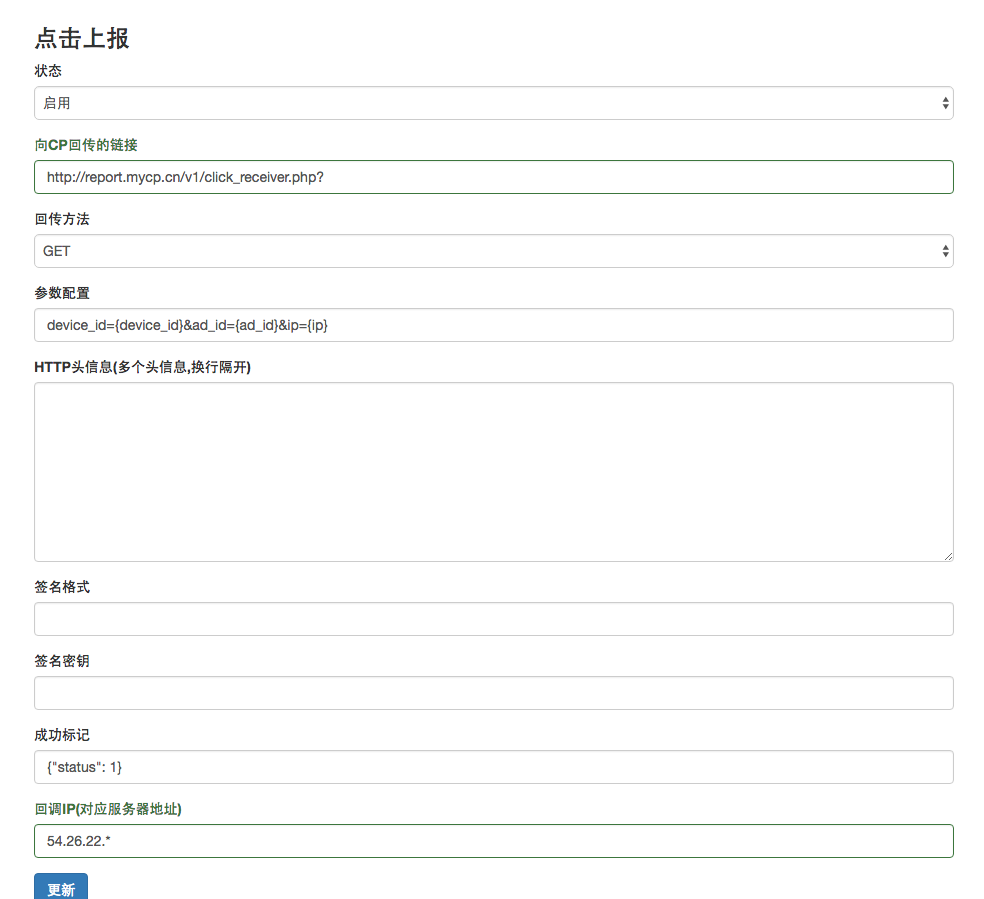

# 点击汇报和安装溯源

## 运行过程

- 当用户在视频播放结束后，点击广告链接，向app store跳转。
- 在此同时，dianview会收到SDK回传的一条点击信息，然后将此信息传递给广告主，传递的信息由广告主设置[点击上报](#click_report)决定。
- 广告主收到点击信息后，应当记录用户信息备查，在新用户成功安装时，向dianview服务器发送安装成功的信息[安装信息回传](#callback)

## 对接准备
- dianview服务器的出口IP是123.56.15.103，如有ip tables之类的安全设置请把此IP加入白名单
- 如果设置http method为post形式，统一会以raw text的方式进行，而不是任何form方式
- 点击汇报会有超时和重试机制，但重试次数不会太多，如果失败率过高的话dianview会自动停止对相应广告主的投放，以防止更多损失产生

## 点击上报

#### 设置

 在广告主后台中进行, 在“广告详情”页中，选择“点击上报”tab页，可以进行点击上报的设置，如下图

#### 参数列表

以下参数是指广告主在点击汇报中可能会收到的参数，但并不都必要，如果要完成点击追踪，至少应该选择`device_id`参数。

一个典型的点击上报链接的格式形如`http://report.mycp.cn/v1/click_receiver.do?device_id={device_id}&client_ip={ip}&ad_id={ad_id}&campaign_id={campaign_id}`

|    参数名  | 类型  | 参数說明 | 范例 | 
| ------------ | -------------| ------------- | ------------ | 
|   `device_id`  | string  | 对于iOS系统来说就是用户的idfa  | D156D534-85A3-4EDA-94D8-EE66196DF333 |
|   `ad_id`  | string  | 广告主的广告id（注意不是campaign_id），16位  | 0d77d3d040771d15 |
|   `ip`  | string | 用户的IP  | 59.78.12.3 |
|   `country_code`  | string | 用户的两位国家编码，此编码由iOS系统给出，与用户真正身处的地理位置不一定一致  | CN |
|   `campaign_id`  | string | 投放计划的id，16位字符串  | 043df362b1911a7b |
|   `os_type`  | string | 操作系统类型，目前只能是iOS  | iOS |
|   `os_version`  | string | 操作系统版本，由iOS系統給出，一般是三位  | 9.3.2 |
|   `device_name` | string | 手机型号  | iPhone 6 |
|   `creative_id` | string | 视频素材编号  | 152693 |
|   `time_stamp`  | int(32) | 发送此点击的时间，Unix时间戳  | 1466753606 |
|   `micro_time_stamp`  | int(64) | 同time_stamp，但是以微秒为单位 | 1466753606000 |
|   `ua`  | string | 用户的user agent  | |

- 用户有可能有重复点击行为，所以广告主应该自行在服务器端去重
- iOS系统给出的机型有可能形如iPhone7,1，并不一定是iPhone 6这样的标准格式，具体的对应关系参见： `https://www.theiphonewiki.com/wiki/Models`

## 安装信息回传

#### 设置

安装信息是由广告主向dianview的服务器发送的，标志着一个用户已经完成的安装行为。

广告主应该在发送前对用户进行进行充分的排重和有效性验证，每一个安装都意味着费用的产生，同时也对广告投放效果调优有关键作用。

#### 安全性验证

 为了验证一个安装记录是由广告主发来的，我们会进行IP验证，只有在白名单中的IP才会被认可，IP白名单的设置在广告主后台“点击上报”的“回调IP”中设置。

#### 参数列表(所有参数都是必填参数)

|    参数名  | 类型  | 参数說明 | 范例 | 
| ------------ | -------------| ------------- | ------------ | 
|   device_id  | string  | 用户的idfa  | D156D534-85A3-4EDA-94D8-EE66196DF333 |
|   ad_id  | string  | 广告主的广告id（注意不是campaign_id），16位  | 0d77d3d040771d15 |
|   flag  | int  | 安装用户是否来自dianview平台，1表示是，0表示否  | 1/0 |

> 广告主向dianview传递flag=0的安装记录，dianview就不会再向这些用户投放此广告，有助于广告投放效率的提升

#### 一个典型的请求

一个典型的安装记录发送链接形如： `http://api.dianview.com/api/install.php?device_id=D156D534-85A3-4EDA-94D8-EE66196DF333&ad_id=0d77d3d040771d15&flag=1`