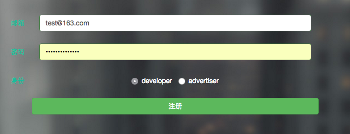
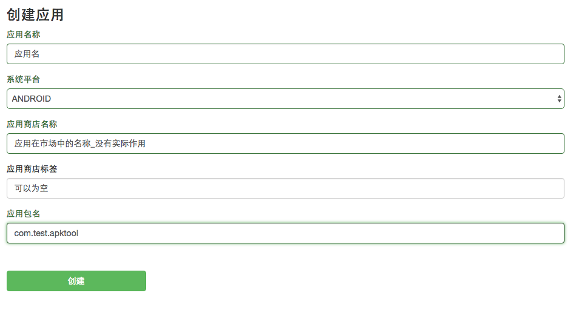

# 安卓开发者接入入门

## 一个安卓开发者的典型接入流程

- [注册](http://www.dianview.com/site/register)和验证开发者账户
- 添加应用（此时是测试应用状态，只能取到测试广告）
- 接入SDK（使用测试应用ID和登记过的测试设备的idfa）
- 提交应用包，请diaview人员测试和审批
- 审批通过之后，可以取到正式广告，此时开发者可以在上架前对应用中的广告体验做二次确认
- 应用上架到市场

## 注册和验证帐户

使用dianview广告平台的第一步是[创建一个帐户](http://www.dianview.com/site/register)，如步骤如下：

- 创建一个开发者帐户(账户只能是邮箱)，选择身份是developer
- 接收自ads@dianview.com的注册激活邮件并激活
- 登录账户

## 添加应用

- 在开发者管理，应用列表中选择[创建应用](http://www.dianview.com/project/app/create)，系统平台选择ANDROID

- 创建应用时主要需要填入应用名称和包名，其他为选填

- 从应用信息中提取`app_id`和`placment_id`（即广告位，详见[广告位的详细介绍](../placement.md)）用于SDK接入

## 对接SDK

详见[SDK对接技术文档](sdk.md)

对接期间应用处于“待审核”状态，此时不能得到正式的广告列表，只能取到固定的测试用的广告列表。

## 提请审批应用

嵌入SDK（使用未审核的app_id）并自测通过后，请联系dianview的媒介和客服人员，以企业版应用的方式提请审批应用，审批通过后，再自行上架到应用市场。

## 优化用户体验和收入

建设中...

## 收入和提款

余额在人民币100元以上时，可以申请提款，点击“账户余额”旁的“+”号创建一个提现工单，我们会在两个工作日内处理提现工单。

在提现之前请在“账号信息”中完善个人或者公司信息，否则提现工单会被拒绝。

## 常见问答

详见和[开发者faq](../dev_faq.md)和 [安卓开发者faq](dev_faq.md)