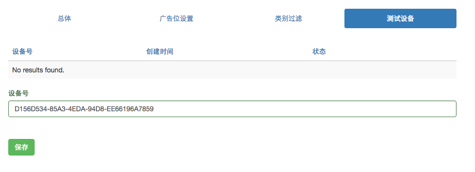

# 开发者自助后台操作指导

## 一个iOS开发者的典型接入流程

- 注册和验证开发者账户
- 添加应用（此时是测试应用状态）
- 接入SDK（使用测试应用ID和登记过的测试设备的idfa）
- 提交应用包，请diaview运营人员审批
- 应用上架或更新到app store

## 注册和验证帐户

使用dianview广告平台的第一步是[创建一个帐户](http://www.dianview.com/site/register)，如步骤如下：

- 创建一个开发者帐户  
- 接收自ads@dianview.com的注册激活邮件并激活
- 登录账户 

## 添加应用

- 在开发者管理，应用列表中选择[创建应用](`http://www.dianview.com/project/app/create`)

- 填入app store中的链接，自动获取应用信息
	- 如果未能正确的获取到包名（因为app store服务器的问题，信息未必能正确获得）
	- 如应用从未上架过，请点击右下方的链接 `应用还没有上架？请点击`。应用正式上架之后，可再在“应用列表”页面中编辑应用属性，填入app store链接或ID。

- 从应用信息中提取`app_id`和`placment_id`（即广告位，详见[广告位的详细介绍](./placement.md)）

## 对接SDK

详见[SDK对接技术文档](./sdk.md)
对接期间应用处于“待审核”状态，此时不能得到正式的广告列表，需要将测试机的idfa添加到“测试设备“列表中，此时这个”测试设备“可以取到固定测试用的广告列表。

## 提请审批应用

嵌入SDK（使用未审核的app_id和测试设备）测试通过后，请联系dianview的媒介和客服人员，以企业版应用的方式提请审批应用，或直接上架app store之后，再提请审批应用。

## 优化用户体验和收入

建设中...

## 收入和提款

余额在人民币100元以上时，可以申请提款，点击“账户余额”旁的“+”号创建一个提现工单，我们会在两个工作日内处理提现工单。

在提现之前请在“账号信息”中完善个人或者公司信息，否则提现工单会被拒绝。

## 常见问答

详见[开发者faq](./dev_faq.md)