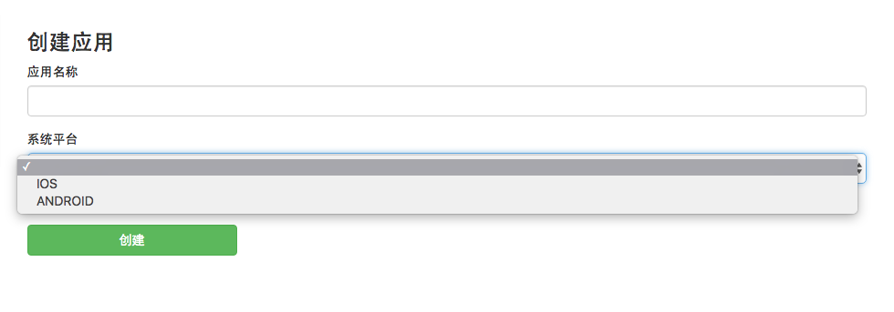
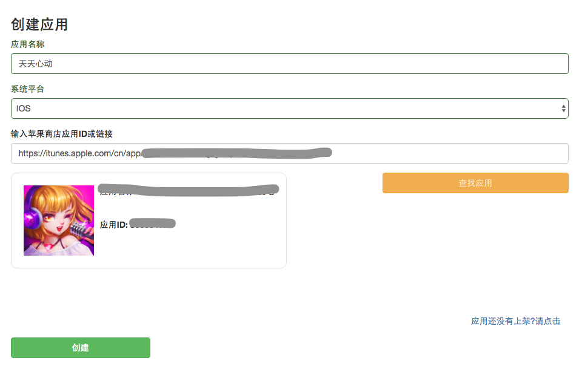
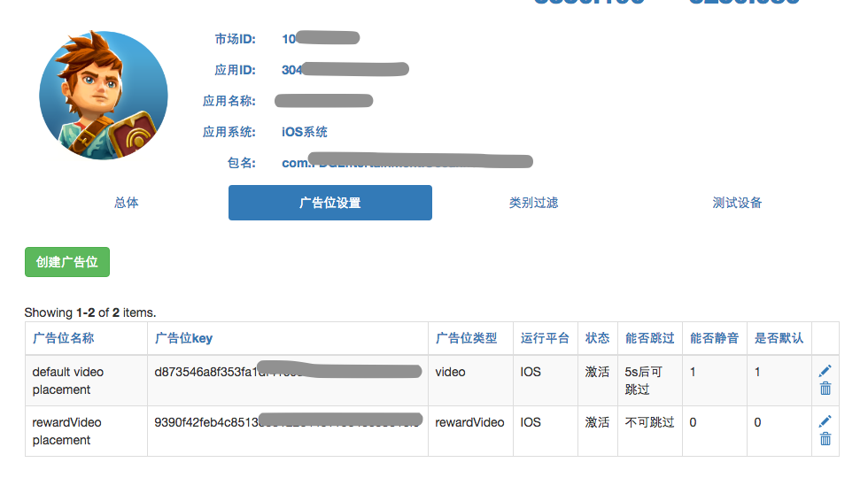

# 开发者自助后台操作指导

## 注册和验证帐户

使用dianview广告平台的第一步是创建一个[帐户](http://www.dianview.com/site/register)，如步骤如下：

- 创建一个dianview开发者帐户  
- 激活验证来自ads@dianview.com的注册激活邮件  
- 激活跳转登录页面  
- 登录账户 

## 添加应用

- 在开发者管理，应用列表中选择[创建应用](`http://www.dianview.com/project/app/create`)

- 填入app store中的链接，自动获取应用信息

- 从应用信息中提取`app_id`和`placment_id`（广告位）

## 对接SDK

详见[SDK文档](./sdk.md)

## 提请审批应用

## 优化用户体验和收入

建设中...

## 收入和提款

建设中...

## 常见问答

详见[开发者faq](./dev_faq.md)