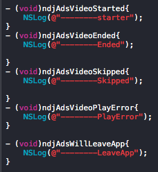

# DianView 视频SDK嵌入指南

## 对接说明

- 本SDK仅支持`iOS7.0及以上`，低版本无法完成嵌入
- 当前sdk暂未支持自助接入，如果有接入需求或对我们sdk感兴趣，请联系<dev.support@dianview.com>

## 概要说明

DianView广告SDK iOS版，SDK中包含两个文件：libNDJVideoFramework.a,NDJWorkSpace.h

## 接入过程
#### 1. 注册并获取DianView平台AppId

> 因为当前sdk版本暂未支持自助接入，如果有接入需求或对我们sdk感兴趣，请联系<dev.support@dianview.com>

** 在appid未审核通过之前，请使用我们对外Demo中的AppId：**`304ddb29fa194887`**进行测试，测试通过后再改回您的AppId**

#### 2. 在工程中添加DianView平台SDK
1. 将获取到的DianView视频广告SDK IOS版压缩包解压后的头文件和.a文件加入到工程中
2. 添加SDK需要的库，具体如下：

#### 3. 接入DianView SDK
##### 1. 导入头文件

##### 2. 调用初始化的方法

##### 3. 调用播放视频

##### 4. 通过回调方法获得sdk行为结果

