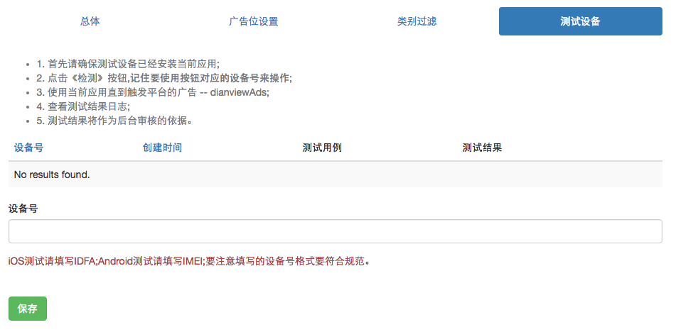
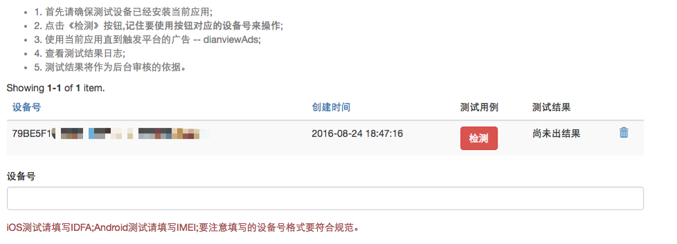
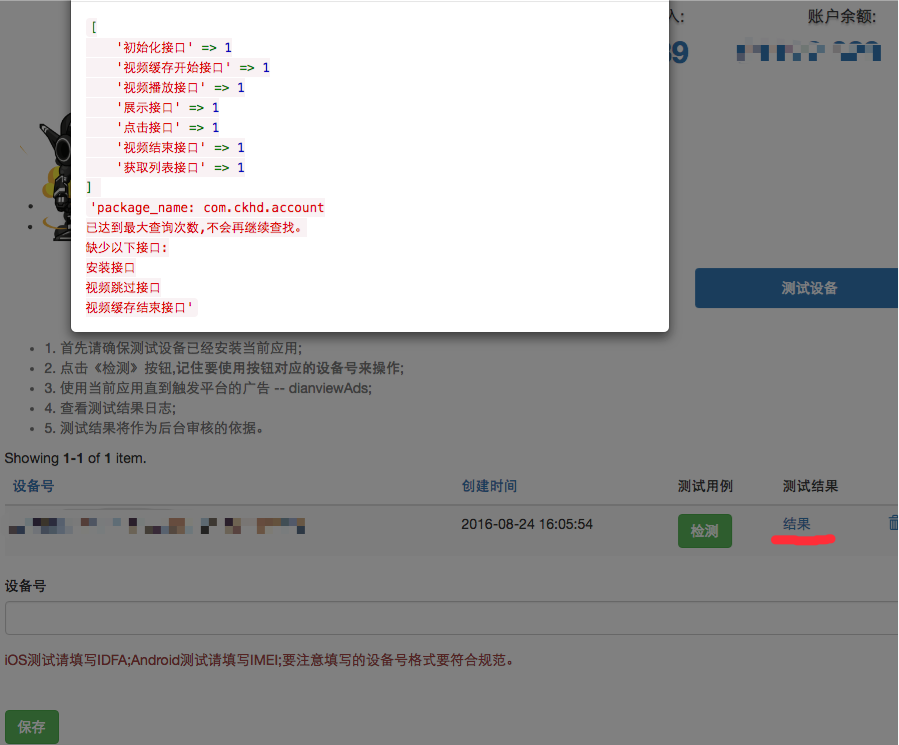

# 开发者测试功能

dianview Ads平台(以下简称平台) 在后台提供了开发者**自测**的功能。这一步应该在应用通过审核之前进行，由开发者自行操作。后台会以此为依据来审核应用，如果没有对应的数据，将会导致审核失败。

## 添加测试设备
对于每一个应用都有一个测试设备模块，主要用于添加当前应用所需要的测试设备。测试设备在平台上可以请求正式广告，即使应用尚未通过审核。

iOS和Android的设备号要符合规范。不然会添加失败。

## 提交测试申请
如果添加了一个设备号，那么就有如下内容：

每一个设备都会对应一个按钮《检测》，点击按钮将会提交一个任务。此时开发者应该开始**操作**自己的应用，触发平台的广告，走通整个测试流程。这里会将本次操作的记录展现出来，并将查询结果展示出来。这一个结果也会展现给平台的审核人员，审核人员会将此作为审核依据，做出判断。请尽可能确保每一个接口都能正确触发。

点击《结果》，可以看到本次测试的结果。会告知本次测试，触发了哪些接口，缺少了哪些接口，以及基本信息比如包名。

至此开发者的测试工作就算完成了，而平台的测试人员将会查看本次测试的结果并作出判断。如果没有测试数据作为依据，将极大增加审核不通过的风险。因此希望每个开发者能完整执行以上的流程。

